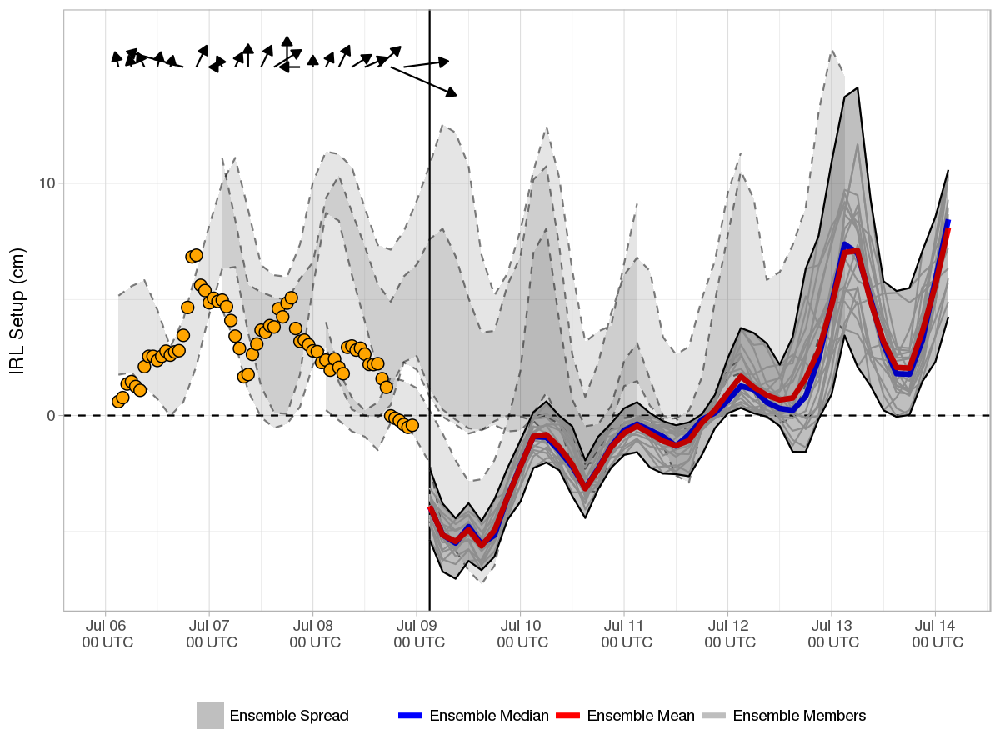

Current Forecast 2019-05-15, Cycle 12 UTC
-----------------------------------------

> Forecast valid 2019-05-15 14:35:17.

Explanation
-----------

The above image shows the ensemble forecast of [Indian River Lagoon
(IRL)](https://en.wikipedia.org/wiki/Indian_River_Lagoon) setup, defined
as the difference in water elevation between Titusville, FL (orange
star), and Sebastian, FL (white star). In general, southerly (northerly)
winds result in increased water elevation near Titusville (Sebastian)
and positive (negative) setup.

The forecast results are provided for 00, 06, 12, and 18 UTC [Global
Ensemble Forecast System
(GEFS)](https://www.ncdc.noaa.gov/data-access/model-data/model-datasets/global-ensemble-forecast-system-gefs)
cycles. Calculation of the IRL setup is performed shortly after a new
GEFS cycle is made available on the [data access
link](http://www.ftp.ncep.noaa.gov/data/nccf/com/gens/prod/). The
current cycle 2019-05-15 12 UTC 0.5° GEFS mean and median forecasts of
setup are represented by the red and blue curves, respectively. Ensemble
spread from the current and three previous GEFS runs are shaded grey and
bounded by solid and dashed curves, respectively.

Because real time observations of IRL setup do not exist, for
verification purposes hourly estimates are provided (orange points)
using wind observations from [Orlando Melbourne International Airport
(KMLB)](https://en.wikipedia.org/wiki/Orlando_Melbourne_International_Airport)
following Colvin et al. (2017).

Additional Research
-------------------

Real time coastal wind, wave, and water level guidance for the IRL is
provided by the [Florida Tech ADCIRC Storm Guidance System
(FIT-ASGS)](https://fl-asgs.github.io/ECFL-IRL/).

Reference
---------

[Wind driven setup in east central Florida's Indian River Lagoon:
Forcings and
pameterizations](https://www.sciencedirect.com/science/article/pii/S0272771418303421)

Jeffrey Colvin, Steven Lazarus, Michael Splitt, Robert Weaver, Peyman
Taeb.
